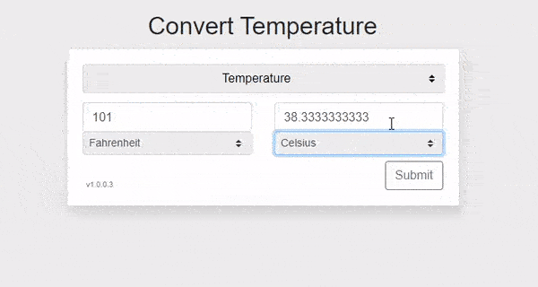

# measurement conversion
Converts distance, volume, mass, speed, and temperatures from one format to several others

# How to use this application

It is pretty simple. No database required. Simply clone the repository or download the .zip file. Move the meansurement-conversion-master directory to your web server's public_html or htdocs directory, then load it up in your browser. If you installed in /home/paul/public_html/measurement-conversion and your server is on your local machine, visit localhost/meansurement-conversion or whatever you renamed the directory to.

# Current Conversions

As of 06.28.2020, this tool will convert:

1. Area
2. Digital Storage
3. Fuel Economy
4. Length and distance
5. Mass and weight
6. Speed
7. Temperature
8. Time
9. Volume and capacity

# How it works - the basics

It begins by converting units of measurement to a common unit. Hang on, let me explain that. Using the Time class as an example, it converts everything to seconds. 1 second = 1 second. 1 minute = 60 seconds, so on and so forth. Then, it converts the requested unit from seconds to whatever you chose. For example, if you selected to convert 1 week into days, the application knows that 1 days is equivalent to 86,400 seconds and 1 week is equivalent to 604,800. How does it know that? Well, it is programmed to know these things. From here, it divides 604,800 seconds / 86,400 seconds and that equals 7 days. On the other hand, if you chose 2 days and wanted to know how many seconds that was, all that it does there is take what it already knows, that 1 day is 86,400 seconds and it multiplies it by 2 which equals 172800. The entire script is fairly simple, really. 

# Can I add other units to convert?

Yes, you can. The most simple route to take would be to copy an existing class file found in /includes/classes/conversion/ and rename it. If you're converting Energy, name it energy.class.php. The naming is important here as the autoload function is looking for this exact format. Once you've renamed the file, open it in your favorite text editor.

1. Copy an existing class file and rename it appropriately. Of course, edit the actual class name within. I advise against using area or temperature classes as a template.
2. Update index.php: around line 40, you will see the menu items. Copy one line and paste it in where you would like it to appear. Rename the variables appropriately.
3. Update /includes/shared/default-values.php: Add a new $drop_class element to the array suitable for the new unit
4. Still on default-values.php, add a new case to the switch statement that suits your new unit.
5. If desired, update /assets/js/script.js. Read the docs for the select function and apply an additional switch statement for default values

The final step would be me asking you to create a pull request if you create a new conversion unit. I'll review it and merge it in. Of course, it goes without saying but.. I'll add your name to the documentation with an @author tag if you would like.

# Project Overview

During a PHP Development course, I was asked to create an online tool that converts measurements from one format to another. The tool would need to handle items such as length or distance, area, volume and capacity, mass and weight, speed, temperature, and digital storage units. 

Beginning with length and distance measurements seemed like a great starting point that would drive the design decisions. Length and Distance are both terms that describe a measurement between two points. One could note that height, width, as well as depth are also considered length measurements. These measurements, though, also provide details regarding the orientations of the lengths of an object. 

This is not always so cut and dry. Length or distance measurements come in many different flavors depending on geographical location or even context. The easiest starting point was determining some common units of measuring lengths.

1. Imperial system of measurement
  
  inch, 
  foot, 
  yard, 
  mile

2. Metric

  millimeter, 
  centimeter, 
  meter, 
  kilometer

While there are many other systems for measuring length or distance out there, such as the maritime measurements of a fathom, cable, nautical mile, or league, the project calls for only the most common types. It's possible that more will be added at a later date.

# The Challenge

There are at least two approaches to the project

1. Maintain formulas to convert each unit to every other possible unit.
  This would come to mean that doing a conversion from miles, for example, to kilometers, one formula would be required.
  To go from x miles to y yards, a second formula would be required.

There are benefits to this approach. Any conversion that is taking place would be done easily in one simple calculation. On the other hand, there would be an ever growing number of formula's to maintain. If there were only 10 length units, the number of formula's necessary to maintain would be equal to (9+8+7+6+5+4+3+2+1) = 45 total formulas to maintain. If a future update required an additional measurement format, making the total length units 11, 55 formulas in total would be required. 12 length units then would require a total of 66 formulas. This appeared to be the most simple approach until one considered future updates. With so many formulas to create and maintain, I foresaw my weekends and spare time fading away before my eyes.

2. Choose 1 and only 1 unit to be a "common" unit for length.
  In this way, only one formula is necessary to be maintained to convert every other unit to the common unit. This common unit would act 
  as something of a bridge between the different units. This same principle can be applied to every category of measurement units that
  is required by the project.
  
With approach number 2, if converting miles to inches, for example, we do not need to maintain a formula that directly converts from miles to inches. Instead, the miles unit would be converted to meters and then the conversion from meters to inches would take place.

This means that for 10 length units, only 9 formulas are required. Of course, it is not necessary to convert meters to meters. Only the other 9 units would require conversion. This is why there would only be 9 formulas as opposed to 10.

In this way, if a future update required additional units of measure to be added, - only one - formula per unit would be necessary.

On the other end of the spectrum, with approach number 2, we're performing multiple calculations within the code instead of just one.
- The calculations performed by PHP7 are very fast.
- The conceptual simplicity, reduction in work load and time spent maintaining the formulas and less code make this a worthwhile trade-off.

The next question to arise was which unit to use as a common unit. After much consideration, it was determined that the common unit should be Meters / Metres. Meters are an international standard for length, otherwise known as the SI unit. Due to this fact, it was decided that it would be a great unit to begin the length conversion portion of the project with. 

# Fun Fact

Most English speaking countries spell it Metres, while those in the United States spell it Meters. As I live in the United States, this is the spelling I chose to use in my code. 

# The Approach

With the project blue prints neatly organized and the approach settled on option 2, It was time to roll out out the plan of action. For each unit of measurement, a common unit would be required

- Length and distance: Meters
- Volume and capacity: Liter
- Mass and weight: Kilogram
- Area: Square Meters
- Speed: Meters per second
- Temperature: Celsius / Centigrade

~~If text is typed in, a typeError is to be thrown. Only integers or floating point numbers are allowed.~~

After the project was reviewed, I modified the code so it will catch the typeError but does nothing with it currently. The UI uses a touch of HTML 5 which allowed me to set the inputs to accept only numbers (with the exception of the letter 'e'). This is subject to breaking changes at any given moment.

Each category of measurement will have at least 3 functions. convertTo*, convertFrom*, and convert*

~~The project is small and tightknit, as such, defining a class or multiple classes is not a necessity. ~~

The codebase has been refactored to include an object-oriented design. v1.1.0.0 is the first iteration of the new design changes.

Functional programming would be acceptable, and due to a deadline, is recommended. May be modified to use Object Oriented Design later.

Use Bootstrap 4 CSS framework for the front-end design. As the deadline looms, no need to worry too much about the look and feel.

The project is to be done using PHP. -- jQuery or JavaScript usage is optional. --

I wanted the final project to look close to the conversion calculator found on <a href="https://www.google.com/search?sxsrf=ALeKk02yMSXoA6FrTHJd-_1B_uWdZgHx-w%3A1592765684913&source=hp&ei=9KzvXpTfNY_btAaMgLi4Cw&q=length+conversion&oq=length+conversion&gs_lcp=CgZwc3ktYWIQAzIKCAAQsQMQFBCHAjICCAAyAggAMgIIADICCAAyAggAMgIIADICCAAyAggAMgIIADoECCMQJzoFCAAQkQI6BQgAELEDOgUIABCDAToHCAAQFBCHAjoICAAQsQMQkQJQpRVY3CRgrCdoAHAAeACAAUmIAYAIkgECMTeYAQCgAQGqAQdnd3Mtd2l6&sclient=psy-ab&ved=0ahUKEwiUqe7GypPqAhWPLc0KHQwADrcQ4dUDCAk&uact=5" target="_blank">google.com</a>.

# The finished product

In the end, the web application looks and feels exactly the same on a large view port as it does on a small view port. Visually and functionally, it appears to be similar to the reference on google. The converter on google, however, has a different look on small view ports then it does on larger view ports. While it does look sleek, I prefer the same experience regardless of the viewport size. 

Given that JavaScript is enabled, the end-user has the ability to type into either input and output will appear in the opposite input box. 

By default, once a section loads, the application selects the to_unit and the from_unit select drop down list options and submits the form via ajax to provide the user something other than an empty form to look at.

With the modification of the input boxes going from type=text to type=number, a handy tool appears on the right hand side of the box when it's hovered over. This allows a person to change the value in the box with a simple click.

Moving from one box to the other, say, from the left to the right, or vice versa for that matter, once focused, the application will auto-select / highlight the numbers so changing the values is a quick and painlesss.

Without JavaScript enabled, degradation is graceful and the end-user can still use the application, though -- with limited functionality. Only the "from_value" input box on the left can be used to enter in values and the right input box, the "to_value" will display the results.

